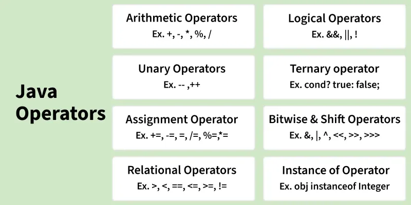
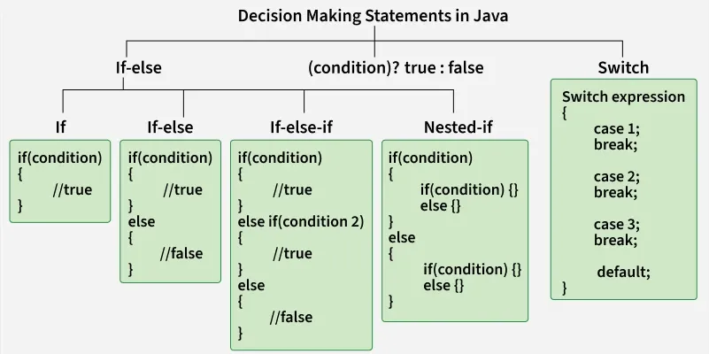

# Introduction to Java

## 1. Who Created Java?

Java was created by **James Gosling** in **1991** while he was working at **Sun Microsystems**.  
He developed Java along with his team members **Mike Sheridan** and **Patrick Naughton**.

Initially, Java was designed for **electronic consumer devices** such as televisions and set-top boxes. It was not originally intended for internet programming.

---

## 2. Original Name of Java

The original name of Java was **Oak**.

The name "Oak" was chosen because there was an **oak tree outside James Gosling’s office**. Later, it was discovered that the name Oak was already registered as a trademark by another company.

Because of this, the team decided to change the name to **Java**.

The name **Java** was inspired by **Java coffee**, which comes from the **Java island in Indonesia**.

---

## 3. Official Release of Java

Java was officially released in **1995** by **Sun Microsystems**.

One of the main reasons for its popularity was the concept:

**“Write Once, Run Anywhere (WORA)”**

This means that a Java program can run on any system that has a **Java Virtual Machine (JVM)**, without needing to modify the code.

---

## 4. Current Ownership of Java

In **2010**, **Oracle Corporation** acquired **Sun Microsystems**.

After this acquisition, **Oracle became responsible for the development and maintenance of Java**.

---

## 5. Why Java Became Popular

Java became one of the most popular programming languages because of the following features:

- **Platform Independent** – Java programs can run on different operating systems.
- **Object-Oriented** – It follows object-oriented programming concepts.
- **Secure** – Java provides strong security features.
- **Portable** – Java programs can easily run on different devices.
- **Widely Used** – Java is used for **web applications, mobile applications, and enterprise software development**.


# How Java Works (Full Workflow)

## 1. Writing Java Code

A programmer writes Java code in a file with the `.java` extension. This file is called **source code**.

Example:

```java
public class Hello {
    public static void main(String args[]) {
        System.out.println("Hello World");
    }
}
````

Example file name:

```
Hello.java
```

---

## 2. Compilation Using Java Compiler (javac)

Java source code cannot run directly on a computer. It must first be compiled using the **Java compiler**.

Command:

```
javac Hello.java
```

The compiler converts the source code into **Bytecode**.

Output file:

```
Hello.class
```

The `.class` file contains **bytecode**, which is an intermediate code.

---

## 3. Bytecode

Bytecode is not machine code. It is an **intermediate code** that can run on any system using the **Java Virtual Machine (JVM)**.

Advantages of Bytecode:

* Makes Java **platform independent**
* The same program can run on **Windows, Linux, or Mac**

This is why Java follows the concept:

**Write Once, Run Anywhere (WORA)**

---

# Java Runtime Components

To run Java programs, three important components are used:

* JVM (Java Virtual Machine)
* JRE (Java Runtime Environment)
* JDK (Java Development Kit)

Relationship:

```
JDK
 └── JRE
      └── JVM
```

Meaning:

* **JDK contains JRE**
* **JRE contains JVM**

---

## JVM (Java Virtual Machine)

The **Java Virtual Machine (JVM)** is responsible for executing the bytecode. It converts bytecode into **machine code** so that the computer can execute it.

Main responsibilities of JVM:

* Executes bytecode
* Provides memory management
* Performs garbage collection
* Ensures platform independence

Different operating systems have different JVM implementations, but they all run the same bytecode.

Examples:

* Windows JVM
* Linux JVM
* Mac JVM

---

## JRE (Java Runtime Environment)

The **JRE** provides the environment required to run Java programs.

JRE contains:

* JVM
* Java libraries
* Supporting runtime files

Structure:

```
JRE
 ├── JVM
 └── Java Libraries (lib)
```

If you only want to **run Java programs**, installing JRE is enough.

---

## JDK (Java Development Kit)

The **JDK** is used for developing Java programs. It contains everything needed to **write, compile, and run** Java programs.

JDK includes:

* Java Compiler (`javac`)
* Development tools
* JRE

Structure:

```
JDK
 ├── Compiler (javac)
 ├── Development Tools
 └── JRE
      ├── JVM
      └── Libraries
```

Summary:

* **JDK → Used for development**
* **JRE → Used to run Java programs**
* **JVM → Executes bytecode**

---

# Complete Java Execution Flow

```
Programmer
   ↓
Write Java Code (.java)
   ↓
Java Compiler (javac)
   ↓
Bytecode (.class)
   ↓
JVM (Java Virtual Machine)
   ↓
Machine Code
   ↓
Operating System
   ↓
Hardware
   ↓
Program Output
```


## -> JVM, JRE, and JDK – Simple Explanation

To understand how Java runs a program, we must understand **JVM, JRE, and JDK**.

Their relationship is:

JDK  
 └── JRE  
      └── JVM  

This means:

- **JDK contains JRE**
- **JRE contains JVM**

So when you install **JDK**, you automatically get **JRE and JVM**.

---

# 1. JVM (Java Virtual Machine)

## What is JVM?

The **Java Virtual Machine (JVM)** is the engine that runs Java programs.

When you write Java code and compile it, the compiler creates **bytecode (.class file)**.  
The **JVM reads this bytecode and converts it into machine code** that the computer can understand.

Because different operating systems have their own JVM, the **same Java program can run on different systems** like:

- Windows
- Linux
- macOS

This is why Java is called **platform independent**.

---

## Main Responsibilities of JVM

### 1. Class Loading
The JVM loads the compiled `.class` files into memory before execution.

### 2. Bytecode Verification
JVM checks the bytecode to make sure it is **safe and valid** before running it.

### 3. Execution Engine
The execution engine runs the bytecode using:

- **Interpreter** – executes code line by line
- **JIT Compiler (Just-In-Time Compiler)** – converts frequently used code into faster machine code

### 4. Memory Management
JVM manages memory automatically using different memory areas like:

- Heap
- Stack
- Method Area

### 5. Garbage Collection
JVM automatically removes unused objects from memory.  
This process is called **Garbage Collection**.

---

# 2. JRE (Java Runtime Environment)

## What is JRE?

The **Java Runtime Environment (JRE)** provides everything needed to **run Java programs**.

JRE includes:

- JVM
- Java libraries
- Supporting runtime files

Structure:

JRE  
 ├── JVM  
 └── Java Libraries  

If someone only wants to **run a Java program**, installing **JRE is enough**.

However, **JRE cannot compile Java programs**.

---

## Java Libraries

Java libraries contain ready-made classes that developers can use.

Examples:

- **java.lang** → basic language classes  
- **java.util** → utility classes like ArrayList, HashMap  
- **java.io** → input and output operations  
- **java.net** → networking

These libraries help developers avoid writing everything from scratch.

---

# 3. JDK (Java Development Kit)

## What is JDK?

The **Java Development Kit (JDK)** is used by developers to **create Java programs**.

It contains everything needed to:

- Write Java programs
- Compile Java programs
- Run Java programs
- Debug Java programs

Structure:

JDK  
 ├── Java Compiler (javac)  
 ├── Development Tools  
 └── JRE  
      ├── JVM  
      └── Libraries  

---

## Important Tools in JDK

### javac
The **Java compiler** that converts `.java` files into `.class` bytecode files.

Example:

```

javac Hello.java

```

### java
Used to **run the compiled Java program**.

Example:

```

java Hello

```

### javadoc
Generates documentation from Java source code.

### jar
Packages multiple Java files into a single archive file.

### jdb
A debugging tool used to find and fix errors in Java programs.

---

# Difference Between JVM, JRE, and JDK

| Component | Purpose |
|------|------|
| JVM | Executes Java bytecode |
| JRE | Provides the environment to run Java programs |
| JDK | Provides tools to develop Java programs |

Simple rule:

JDK → JRE → JVM

---

# Common Interview Questions

### 1. What is the difference between JVM, JRE, and JDK?

- **JVM** executes the Java bytecode.
- **JRE** provides the environment needed to run Java programs.
- **JDK** provides tools for developing Java programs.

---

### 2. Why is Java platform independent?

Java is platform independent because Java code is compiled into **bytecode**, and this bytecode can run on any system that has a **JVM**.

---

### 3. What is Bytecode?

Bytecode is the **intermediate code generated by the Java compiler**.  
It is stored in `.class` files and executed by the JVM.

---

### 4. What is JIT Compiler?

The **Just-In-Time (JIT) Compiler** improves performance by converting frequently used bytecode into **native machine code**.

---

### 5. What is Garbage Collection?

Garbage Collection is the process where the **JVM automatically removes unused objects from memory** to free space.

---

### 6. Can Java run without JVM?

No. Java programs cannot run without JVM because JVM is responsible for executing the bytecode.

---


# First Java Program – Hello World Explained

The first program most people write when learning Java is the **Hello World program**.  
This program simply prints a message on the screen.

Example:

```java
public class Hello {
    public static void main(String[] args) {
        System.out.println("Hello World");
    }
}
````

Now let's understand **every part of this program step by step**.

---

# 1. `public class Hello`

```
public class Hello
```

This line defines a **class**.

### What is a Class?

A **class** is like a blueprint or template used to create objects in Java.
Every Java program must be written inside a **class**.

### Breaking it down

#### `public`

`public` is an **access modifier**.

It means the class can be **accessed from anywhere**.

In simple words:

* `public` makes the class **visible to the JVM and other classes**.

#### `class`

`class` is a **keyword used to create a class in Java**.

It tells the compiler that we are **defining a class**.

#### `Hello`

`Hello` is the **name of the class**.

Important rule in Java:

If the class is declared **public**, the **file name must be the same as the class name**.

So the file must be named:

```
Hello.java
```

If the file name does not match the class name, the program will not compile.

---

# 2. `public static void main(String[] args)`

```
public static void main(String[] args)
```

This is the **main method**.

The **main method is the starting point of every Java program**.
When the program runs, the **JVM starts execution from this method**.

Let's break this line into parts.

---

## `public`

`public` means the method is **accessible from anywhere**.

The JVM must be able to **access this method to start the program**.

That is why the `main` method must always be **public**.

---

## `static`

`static` means the method **belongs to the class, not to an object**.

Because of this, the JVM can call the method **without creating an object of the class**.

If `static` was not used, the JVM would first need to create an object before running the program.

---

## `void`

`void` is the **return type**.

It means the method **does not return any value**.

The `main` method simply **runs the program**, so it does not return anything.

---

## `main`

`main` is the **name of the method**.

This is a **special method** because the JVM looks for this method to start program execution.

If the method name is not `main`, the program will not run.

---

## `String[] args`

```
String[] args
```

This means **an array of strings**.

It allows the program to receive **command line arguments** when the program starts.

Example:

```
java Hello John
```

Here:

```
John
```

will be stored inside `args`.

So:

* `String[]` → an array of strings
* `args` → variable name

---

# 3. Curly Braces `{ }`

```
{
}
```

Curly braces define a **block of code**.

They tell the compiler **where the class or method starts and ends**.

Example:

```
class Hello {
    // code inside class
}
```

---

# 4. `System.out.println("Hello World");`

```
System.out.println("Hello World");
```

This line prints text on the screen.

Let's break it down.

---

## `System`

`System` is a **built-in Java class** from the `java.lang` package.

It provides access to system resources like:

* input
* output
* memory

---

## `out`

`out` is an **object of PrintStream** inside the System class.

It represents the **standard output stream**, which usually means the **console (screen)**.

---

## `println`

`println` is a **method used to print text on the screen**.

`println` means:

**print + new line**

After printing the text, the cursor moves to the **next line**.

Example output:

```
Hello World
```

---

# Difference Between `print()` and `println()`

## `print()`

`print()` prints text but **does not move to the next line**.

Example:

```java
System.out.print("Hello");
System.out.print("World");
```

Output:

```
HelloWorld
```

---

## `println()`

`println()` prints text and **moves the cursor to the next line**.

Example:

```java
System.out.println("Hello");
System.out.println("World");
```

Output:

```
Hello
World
```

---

# 5. Semicolon `;`

In Java, every statement must end with a **semicolon**.

Example:

```
System.out.println("Hello World");
```

The semicolon tells the compiler **the statement has ended**.

---

# Program Execution Flow

1. The programmer writes the code in a `.java` file.
2. The Java compiler (`javac`) compiles the code.
3. A `.class` bytecode file is created.
4. The JVM runs the bytecode.
5. The program output is displayed.

---

# Final Output

When we run the program, the output will be:

```
Hello World
```

---


# **Java Data Types** 

Java is a **statically typed language**.  
This means every variable must have a **data type**, and the compiler checks it **before the program runs**.

Example of invalid assignment:

```java
int x = "Hello"; // Compile-time error
````

Here `x` is an **integer**, but `"Hello"` is a **string**, so Java does not allow it.

---

# What is a Data Type?

A **data type** tells Java:

* what type of value a variable can store
* how much memory is needed to store it

Example:

```java
int age = 21;
```

Here:

* `int` → data type
* `age` → variable name
* `21` → value

---

# Types of Data Types in Java

Java has **two categories of data types**:

1. **Primitive Data Types**
2. **Non-Primitive (Reference) Data Types**

---

# 1. Primitive Data Types

Primitive data types store **simple values directly in memory**.

Java has **8 primitive data types**.

| Data Type | Size          | Example |
| --------- | ------------- | ------- |
| boolean   | JVM dependent | true    |
| byte      | 1 byte        | 10      |
| short     | 2 bytes       | 2000    |
| int       | 4 bytes       | 100     |
| long      | 8 bytes       | 100000L |
| float     | 4 bytes       | 3.14f   |
| double    | 8 bytes       | 3.14159 |
| char      | 2 bytes       | 'A'     |

---

# 1. boolean

Used to store **true or false values**.

Important rule:

Java **does not allow 0 and 1** like C/C++.

Example:

```java
public class BooleanExample {
    public static void main(String[] args) {

        boolean isJavaFun = true;
        boolean isFishTasty = false;

        System.out.println(isJavaFun);
        System.out.println(isFishTasty);
    }
}
```

---

# 2. byte

`byte` is used to store **very small numbers**.

Size:

```
1 byte (8 bits)
```

Range:

```
-128 to 127
```

Example:

```java
public class ByteExample {
    public static void main(String[] args) {

        byte age = 25;

        System.out.println(age);
    }
}
```

---

# 3. short

Used for **slightly larger numbers than byte**.

Size:

```
2 bytes
```

Example:

```java
public class ShortExample {
    public static void main(String[] args) {

        short students = 1000;

        System.out.println(students);
    }
}
```

---

# 4. int

`int` is the **most commonly used integer data type in Java**.

Size:

```
4 bytes
```

Example:

```java
public class IntExample {
    public static void main(String[] args) {

        int population = 2000000;

        System.out.println(population);
    }
}
```

Most whole numbers in Java programs use **int**.

---

# 5. long

Used when numbers are **too large for int**.

Size:

```
8 bytes
```

Important rule:

A long value usually ends with **L**.

Example:

```java
public class LongExample {
    public static void main(String[] args) {

        long worldPopulation = 7800000000L;

        System.out.println(worldPopulation);
    }
}
```

---

# 6. float

Used to store **decimal numbers**.

Size:

```
4 bytes
```

Important rule:

In Java, decimal numbers are **double by default**, so we must add **f** for float.

Example:

```java
public class FloatExample {
    public static void main(String[] args) {

        float pi = 3.14f;

        System.out.println(pi);
    }
}
```

---

# 7. double

Used for **large decimal numbers with higher precision**.

Size:

```
8 bytes
```

Important fact:

Decimal numbers in Java are **double by default**.

Example:

```java
public class DoubleExample {
    public static void main(String[] args) {

        double pi = 3.14159;

        System.out.println(pi);
    }
}
```

---

# 8. char

Used to store **a single character**.

Size in Java:

```
2 bytes
```

Important difference:

| Language | char size |
| -------- | --------- |
| C/C++    | 1 byte    |
| Java     | 2 bytes   |

Java uses **Unicode**, so characters take more memory.

Example:

```java
public class CharExample {
    public static void main(String[] args) {

        char grade = 'A';

        System.out.println(grade);
    }
}
```

Characters must use **single quotes `' '`**.

---

# 2. Non-Primitive (Reference) Data Types

Non-primitive data types **store references (memory addresses)** instead of actual values.

Examples:

* String
* Class
* Object
* Interface
* Array

---

# String

A **String** stores a sequence of characters.

Example:

```java
public class StringExample {
    public static void main(String[] args) {

        String name = "John";

        System.out.println(name);
    }
}
```

Important fact:

Strings in Java are **immutable**, meaning they **cannot be changed after creation**.

---

# Array

An **array** stores multiple values of the same type.

Example:

```java
public class ArrayExample {
    public static void main(String[] args) {

        int[] numbers = {1, 2, 3, 4, 5};

        System.out.println(numbers[0]);
    }
}
```

Arrays start from **index 0**.

---

# Class and Object

A **class** is a blueprint, and an **object** is an instance of that class.

Example:

```java
class Car {

    String model;
    int year;

    void display() {
        System.out.println(model + " " + year);
    }
}

public class Main {
    public static void main(String[] args) {

        Car myCar = new Car();
        myCar.model = "Toyota";
        myCar.year = 2020;

        myCar.display();
    }
}
```

---

# Quick Summary

Primitive Data Types:

* boolean
* byte
* short
* int
* long
* float
* double
* char

Non-Primitive Data Types:

* String
* Class
* Object
* Interface
* Array

Important things to remember:

* `char` in Java = **2 bytes**
* `boolean` = **true or false only**
* decimal numbers are **double by default**
* `float` requires **f**
* `long` often requires **L**


---

# Literals in Java

In Java, a **Literal** is a **fixed value written directly in the program**.

It is the **actual value assigned to a variable**.

Example:

```java
int age = 25;
```

Here:

| Part | Meaning |
|-----|--------|
| `int` | Data type |
| `age` | Variable name |
| `25` | **Literal (actual value)** |

👉 So **25 is a literal** because it is the value written directly in the code.

---

# What Does Literal Mean?

The word **literal** means:

> **A value written exactly as it is in the program.**

Example:

```java
int x = 10;
```

Here:

- `x` → variable  
- `10` → literal  

Because **10 is written directly in the code**.

---

# Examples of Literals

```
10
20
3.14
'A'
"Hello"
true
false
```

All of these are **literals** because they represent **fixed values**.

---

# Types of Literals in Java

Java mainly has **5 types of literals**.

| Literal Type | Example |
|--------------|--------|
| Integer Literal | `10` |
| Floating Literal | `10.5` |
| Char Literal | `'A'` |
| String Literal | `"Hello"` |
| Boolean Literal | `true` |

---

# 1. Integer Literals

Integer literals are **whole numbers without decimal points**.

Example:

```java
int x = 10;
```

Here **10** is an integer literal.

### Integer literals can be written in different number systems:

| Type | Example | Explanation |
|-----|--------|-------------|
| Decimal | `10` | Normal numbers (0-9) |
| Octal | `010` | Starts with `0` |
| Hexadecimal | `0x10` | Starts with `0x` |
| Binary | `0b10` | Starts with `0b` |

Example:

```java
public class IntegerLiteralExample {

    public static void main(String[] args) {

        int a = 10;     // decimal
        int b = 010;    // octal
        int c = 0x10;   // hexadecimal
        int d = 0b10;   // binary

        System.out.println(a);
        System.out.println(b);
        System.out.println(c);
        System.out.println(d);
    }
}
```

---

# 2. Floating Point Literals

Floating literals are **numbers with decimal points**.

Example:

```java
double price = 99.5;
```

Here **99.5** is a floating literal.

### Important Rule

By default, decimal numbers in Java are **double**.

If you want to store them in **float**, you must add `f`.

Example:

```java
float number = 10.5f;
```

---

# 3. Char Literals

Char literals represent **a single character**.

They must be written inside **single quotes `' '`**.

Example:

```java
char grade = 'A';
```

Here `'A'` is a **char literal**.

### Char can also use Unicode

Example:

```java
char letter = '\u0041';
```

Output:

```
A
```

---

# 4. String Literals

A **string literal** is a sequence of characters inside **double quotes `" "`**.

Example:

```java
String name = "Rahul";
```

Here `"Rahul"` is a **string literal**.

### Important Rule

Strings must always use **double quotes**.

Incorrect:

```java
String name = Rahul; // Error
```

Correct:

```java
String name = "Rahul";
```

---

# 5. Boolean Literals

Boolean literals represent **true or false values**.

Only two values exist:

```
true
false
```

Example:

```java
boolean isJavaFun = true;
boolean isStudent = false;
```

Important:

Java **does not allow 0 or 1 for boolean values**.

Incorrect:

```java
boolean x = 1; // Compilation Error
```

---

# Complete Example Program

```java
public class LiteralExample {

    public static void main(String[] args) {

        int age = 21;              // integer literal
        double price = 99.5;       // floating literal
        char grade = 'A';          // char literal
        String name = "Rahul";     // string literal
        boolean isJavaFun = true;  // boolean literal

        System.out.println(age);
        System.out.println(price);
        System.out.println(grade);
        System.out.println(name);
        System.out.println(isJavaFun);
    }
}
```

---

# Quick Summary

| Literal | Example |
|-------|--------|
| Integer | `10` |
| Floating | `3.14` |
| Char | `'A'` |
| String | `"Hello"` |
| Boolean | `true` |

---

# Key Points to Remember

- A **literal is the value written directly in the program**.
- Integer literals represent **whole numbers**.
- Floating literals represent **decimal numbers**.
- Char literals use **single quotes `' '`**.
- String literals use **double quotes `" "`**.
- Boolean literals can only be **true or false**.

---

# One Line Definition (Interview Friendly)

**A literal in Java is a fixed value written directly in the program and assigned to a variable.**

Example:

```java
int x = 10;
```

Here **10 is a literal**.


---


# Type Conversion & Type Casting in Java

When working with Java, you often need to **convert one data type into another**.  
This process is called **Type Conversion** or **Type Casting**.

---

## First, Understand This Line 👇

```java
int x = 10;
double y = x;
```

Here, Java converts `int` to `double`.

👉 This is called **Type Conversion**.

---

## Why Do We Need Type Conversion?

Because different data types store **different sizes and types of values**.

Example:
- `int` → whole numbers
- `double` → decimal numbers

Sometimes we need to:
- store small data into bigger data
- or forcefully convert bigger data into smaller data

---

## Types of Type Conversion in Java

Java supports **two types**:

| Type | Name |
|----|----|
| Automatic | Type Conversion (Widening) |
| Manual | Type Casting (Narrowing) |

---

# 1️⃣ Type Conversion (Widening / Implicit)

### What is Type Conversion?

👉 **Automatically converting a smaller data type into a larger data type**  
👉 Done by **Java itself**  
👉 **No data loss**

---

### Widening Order (Important)

```
byte → short → int → long → float → double
```

---

### Example 1

```java
int a = 10;
double b = a;
```

Explanation:
- `int` → smaller
- `double` → larger
- Java converts automatically

✅ Safe  
✅ No data loss

---

### Example 2

```java
public class TypeConversionExample {
    public static void main(String[] args) {
        int x = 20;
        double y = x;

        System.out.println(x);
        System.out.println(y);
    }
}
```

Output:
```
20
20.0
```

---

### Example 3

```java
byte b = 10;
int i = b;
```

✔ Allowed  
✔ Automatic  
✔ No casting needed

---

### Key Points of Type Conversion

- Happens **automatically**
- Converts **small → large**
- **Safe**
- No data loss
- Also called **Implicit Conversion**

---

# 2️⃣ Type Casting (Narrowing / Explicit)

### What is Type Casting?

👉 **Manually converting a larger data type into a smaller data type**  
👉 Done by **programmer**  
👉 **Data loss may occur**

---

### Narrowing Order

```
double → float → long → int → short → byte
```

---

### Example 1

```java
double x = 10.5;
int y = (int) x;
```

Explanation:
- `double` → larger
- `int` → smaller
- `(int)` is required

Output:
```
10
```

❗ Decimal part is lost

---

### Example 2

```java
public class TypeCastingExample {
    public static void main(String[] args) {
        double price = 99.99;
        int value = (int) price;

        System.out.println(price);
        System.out.println(value);
    }
}
```

Output:
```
99.99
99
```

---

### Example 3 (Data Loss)

```java
int a = 130;
byte b = (byte) a;
```

Output:
```
-126
```

⚠ Because byte range is **-128 to 127**

---

### Key Points of Type Casting

- Done **manually**
- Converts **large → small**
- **Risky**
- Data loss possible
- Also called **Explicit Casting**

---

# Difference Between Type Conversion & Type Casting

| Feature | Type Conversion | Type Casting |
|------|----------------|-------------|
| Done by | Java | Programmer |
| Direction | Small → Large | Large → Small |
| Safety | Safe | Risky |
| Data Loss | No | Yes |
| Syntax | Automatic | `(type)` required |

---

# Very Important Interview Trick ⭐

### This works ✅

```java
int a = 10;
double b = a;
```

### This does NOT ❌

```java
double a = 10.5;
int b = a;   // Error
```

### Correct Way ✔

```java
double a = 10.5;
int b = (int) a;
```

---

# Type Casting with char

```java
char ch = 'A';
int ascii = ch;
```

Output:
```
65
```

Reverse:

```java
int num = 66;
char ch = (char) num;
```

Output:
```
B
```

---

# Complete Example Program

```java
public class TypeConversionCasting {

    public static void main(String[] args) {

        // Type Conversion
        int a = 10;
        double b = a;

        // Type Casting
        double x = 20.75;
        int y = (int) x;

        System.out.println(b);
        System.out.println(y);
    }
}
```

---

# Common Beginner Mistakes ❌

❌ Forgetting casting:
```java
double d = 5.5;
int i = d; // Error
```

✔ Correct:
```java
int i = (int) d;
```

---

# Simple Way to Remember 🧠

| Rule |
|----|
| Small → Big = Automatic |
| Big → Small = Manual |

---

# One Line Definitions (Exam / Interview)

**Type Conversion:**  
Automatic conversion of smaller data type into larger data type.

**Type Casting:**  
Manual conversion of larger data type into smaller data type.

---

# Final Summary

- Type Conversion = automatic, safe, widening
- Type Casting = manual, risky, narrowing
- Casting uses `(datatype)`
- Data loss happens only in type casting.


##  Types of Operator in java



# Java Operators (Complete Beginner Guide)

Java operators are **special symbols** that perform operations on variables or values.  
They help us **calculate, compare, assign, and manipulate data** in Java programs.

---

## Types of Operators in Java

Java provides **8 main types of operators**:

1. Arithmetic Operators
2. Unary Operators
3. Assignment Operators
4. Relational Operators
5. Logical Operators
6. Ternary Operator
7. Bitwise Operators
8. `instanceof` Operator

---

## 1️⃣ Arithmetic Operators

Arithmetic operators are used to perform **basic mathematical operations**.

| Operator | Meaning |
|--------|--------|
| `+` | Addition |
| `-` | Subtraction |
| `*` | Multiplication |
| `/` | Division |
| `%` | Modulus (remainder) |

### Example

```java
public class ArithmeticOperators {
    public static void main(String[] args) {
        int a = 10, b = 3;

        System.out.println("Sum: " + (a + b));
        System.out.println("Difference: " + (a - b));
        System.out.println("Multiplication: " + (a * b));
        System.out.println("Division: " + (a / b));
        System.out.println("Modulus: " + (a % b));
    }
}
```

### Output
```
Sum: 13
Difference: 7
Multiplication: 30
Division: 3
Modulus: 1
```

📌 **Note:** Division between integers gives an integer result.

---

## 2️⃣ Unary Operators

Unary operators work on **only one operand**.

| Operator | Meaning |
|--------|--------|
| `++` | Increment |
| `--` | Decrement |
| `!` | Logical NOT |

### Example

```java
class UnaryOperators {
    public static void main(String[] args) {
        int a = 10;
        int b = 10;

        System.out.println("Post-increment: " + (a++));
        System.out.println("Pre-increment: " + (++a));

        System.out.println("Post-decrement: " + (b--));
        System.out.println("Pre-decrement: " + (--b));
    }
}
```

### Output
```
Post-increment: 10
Pre-increment: 12
Post-decrement: 10
Pre-decrement: 8
```

📌 **Tip:**
- `a++` → use first, then increase
- `++a` → increase first, then use

---

## 3️⃣ Assignment Operators

Assignment operators assign values to variables.

| Operator | Meaning |
|--------|--------|
| `=` | Assign |
| `+=` | Add and assign |
| `-=` | Subtract and assign |
| `*=` | Multiply and assign |
| `/=` | Divide and assign |
| `%=` | Modulus and assign |

### Example

```java
public class AssignmentOperators {
    public static void main(String[] args) {
        int n = 10;

        n += 5;
        System.out.println(n);

        n *= 2;
        System.out.println(n);

        n -= 5;
        System.out.println(n);

        n /= 2;
        System.out.println(n);

        n %= 3;
        System.out.println(n);
    }
}
```

---

## 4️⃣ Relational Operators

Relational operators **compare two values** and return a **boolean result**.

| Operator | Meaning |
|--------|--------|
| `>` | Greater than |
| `<` | Less than |
| `>=` | Greater than or equal |
| `<=` | Less than or equal |
| `==` | Equal |
| `!=` | Not equal |

### Example

```java
class RelationalOperators {
    public static void main(String[] args) {
        int a = 10, b = 3;

        System.out.println(a > b);
        System.out.println(a < b);
        System.out.println(a >= b);
        System.out.println(a <= b);
        System.out.println(a == b);
        System.out.println(a != b);
    }
}
```

---

## 5️⃣ Logical Operators

Logical operators are used with **boolean values**.

| Operator | Meaning |
|--------|--------|
| `&&` | Logical AND |
| `||` | Logical OR |
| `!` | Logical NOT |

### Example

```java
class LogicalOperators {
    public static void main(String[] args) {
        boolean x = true;
        boolean y = false;

        System.out.println(x && y);
        System.out.println(x || y);
        System.out.println(!x);
    }
}
```

📌 **Short-circuiting:**  
Java skips the second condition if the result is already known.

---

## 6️⃣ Ternary Operator

The ternary operator is a **short form of if-else**.

### Syntax
```
condition ? value1 : value2
```

### Example

```java
class TernaryOperator {
    public static void main(String[] args) {
        int a = 20, b = 10;
        int max = (a > b) ? a : b;

        System.out.println(max);
    }
}
```

---

## 7️⃣ Bitwise Operators

Bitwise operators work at the **bit level**.

| Operator | Meaning |
|--------|--------|
| `&` | AND |
| `|` | OR |
| `^` | XOR |
| `~` | NOT |
| `<<` | Left shift |
| `>>` | Signed right shift |
| `>>>` | Unsigned right shift |

### Example

```java
class BitwiseOperators {
    public static void main(String[] args) {
        int d = 0b1010;
        int e = 0b1100;

        System.out.println(d & e);
        System.out.println(d | e);
        System.out.println(d ^ e);
        System.out.println(~d);
        System.out.println(d << 2);
        System.out.println(e >> 1);
        System.out.println(e >>> 1);
    }
}
```

## **Important:**

1️⃣ **What `>>` and `>>>` do**
---

## Difference Between `>>` and `>>>` 

### `>>` (Signed Right Shift)

* Shifts bits to the right
* **Keeps the sign**
* Fills left bits with:

    * `0` for positive numbers
    * `1` for negative numbers

### `>>>` (Unsigned Right Shift)

* Shifts bits to the right
* **Ignores the sign**
* Always fills left bits with `0`

---

## Example That Produces `-4`

```java
int x = -8;
System.out.println(x >> 1);
```

---

## How `-4` Comes (Step by Step)

### Step 1: Binary of `-8` (8-bit simplified)

```
-8 = 11111000
```

(First bit is `1` → number is negative)

---

### Step 2: Apply `>> 1`

Right shift by 1 bit
Copy the sign bit (`1`) on the left

```
Before: 11111000
After : 11111100
```

---

### Step 3: Convert `11111100` to decimal

Since first bit is `1`, Java treats it as **negative**
So we use **Two’s Complement** to find its value

#### Two’s Complement Steps:

1. Invert bits

```
00000011
```

2. Add 1

```
00000100
```

3. Decimal value

```
4
```

4. Add minus sign

```
-4
```

---

## Final Result

```
11111100  =  -4
```

---

## Why `>>>` Does NOT Give `-4`

```java
System.out.println(x >>> 1);
```

### What happens:

```
Before: 11111000
After : 01111100
```

* Left filled with `0`
* Sign ignored
* Number becomes **positive**

So result is a **large positive number**, not `-4`.

---


## 8️⃣ `instanceof` Operator in Java

The **`instanceof` operator** is used to **check the type of an object at runtime**.


👉 `instanceof` checks **whether an object belongs to a specific class, subclass, or interface**.

It answers this simple question:

> ❓ **“Is this object created from this class (or related to it)?”**

### Output of `instanceof`

The result is always:

* `true`
* `false`

---

## 🔹 Syntax

```java
object instanceof ClassName
```

Read it as:

👉 **“Is object a ClassName?”**

---

## 🔹 Example Program (Line-by-Line Explanation)

```java
class InstanceOfExample {
    public static void main(String[] args) {

        String str = "Hello";
        System.out.println(str instanceof String);

        Object obj = new Integer(10);
        System.out.println(obj instanceof Integer);
        System.out.println(obj instanceof String);
    }
}
```

---

## 🔸 Line 1: `String str = "Hello";`

* `"Hello"` is a **String literal**
* `str` is a reference pointing to a **String object**

### Check:

```java
str instanceof String
```

👉 Java internally asks:
**“Is `str` an object of class `String`?”**

✔ Yes → `true`

### Output:

```text
true
```

---

## 🔸 Line 2: `Object obj = new Integer(10);`

📌 **Very important concept**

* `new Integer(10)` creates an **Integer object**
* Reference type is `Object`
* **Actual object is still Integer**

💡 Think like this:

> A child can be referred to as a parent, but the child is still a child.

---

### ✅ Check 1

```java
obj instanceof Integer
```

👉 Java asks:
**“Is `obj` pointing to an Integer object?”**

✔ Yes → `true`

Output:

```text
true
```

---

### ❌ Check 2

```java
obj instanceof String
```

👉 Java asks:
**“Is this object a String?”**

❌ No → object is `Integer`, not `String`

Output:

```text
false
```

---

## 🔹 Final Output of the Program

```text
true
true
false
```

---

## 🔹 VERY IMPORTANT RULES of `instanceof`

### 1️⃣ Checks the **actual object**, not the reference type

```java
Object obj = new Integer(10);
```

Even though reference type is `Object`,
the real object is `Integer`.

```java
obj instanceof Integer   // true
```

---

### 2️⃣ Works with **Inheritance**

```java
class Animal {}
class Dog extends Animal {}

Animal a = new Dog();

a instanceof Dog     // true
a instanceof Animal  // true
```

👉 Because **Dog is an Animal**

---

### 3️⃣ Works with **Interfaces**

```java
interface Animal {}
class Dog implements Animal {}

Dog d = new Dog();
d instanceof Animal   // true
```

---

### 4️⃣ `instanceof` with `null`

```java
String s = null;
System.out.println(s instanceof String);
```

✔ Output:

```text
false
```

📌 `null` is not an object, so result is always `false`.

---

### 5️⃣ Compile-Time Safety Rule

❌ This is **NOT allowed**:

```java
Integer i = 10;
System.out.println(i instanceof String); // Compile-time error
```

❓ Why?

👉 `Integer` and `String` are **unrelated classes**

---

## 🔹 Why Do We Use `instanceof` in Real Life?

### ✅ Safe Type Casting (Most Common Use)

```java
Object obj = "Hello";

if (obj instanceof String) {
    String s = (String) obj; // safe casting
    System.out.println(s.length());
}
```

✔ Prevents `ClassCastException`

---

## 🔹 One-Line Definition (Perfect for Interview / README)

**`instanceof` checks whether an object belongs to a specific class, subclass, or interface at runtime.**

---

## 🔹 Easy Memory Trick 🧠

```java
object instanceof Type
```

Read it as:

👉 **“Is object a Type?”**

---


---

## ⭐ Important Interview Questions (Java Operators)

### 1. Difference between `==` and `=` ?
- `=` → assignment
- `==` → comparison

---

### 2. Difference between `&` and `&&` ?
- `&` → bitwise AND
- `&&` → logical AND (short-circuit)

---

### 3. Difference between `>>` and `>>>` ?
- `>>` → signed right shift
- `>>>` → unsigned right shift

---

### 4. Can we use arithmetic operators on `String`?
- Only `+` (for concatenation)

---

### 5. What does `%` operator do?
- Returns **remainder**

---

## Conditional statement in java
;

---
🧠 Decision Making in Java (Conditional Statements)


Decision making in programming is similar to real-life decision making.
We often want certain code to run only when a condition is true.

👉 In Java, this is done using conditional (decision-making) statements, which control the flow of execution of a program.

🔹 Types of Decision-Making Statements in Java

Java provides the following decision-making constructs:

- if statement

- if-else statement

- nested if statement

- if-else-if ladder

- switch statement

- Ternary operator (?:)

1️⃣ if Statement

The if statement is the simplest decision-making statement.

👉 It executes a block of code only if the condition is true.

Syntax
````
if (condition) {
// code executes if condition is true
}
Example
class A {
public static void main(String args[]) {
int i = 10;

        if (i < 15) {
            System.out.println("Condition is True");
        }
    }
}

````
Output
Condition is True
📌 Important Notes

The condition must return true or false

If {} are omitted, only the next line belongs to if

if (i < 15)
System.out.println("True");
System.out.println("Always runs"); // not part of if
2️⃣ if-else Statement

The if-else statement allows you to execute:

one block if the condition is true

another block if the condition is false

Syntax
````
if (condition) {
// true block
} else {
// false block
}
````
Example

````
class A {
public static void main(String args[]) {
int i = 10;

        if (i < 15)
            System.out.println("i is smaller than 15");
        else
            System.out.println("i is greater than 15");
    }
}

````
Output
i is smaller than 15
3️⃣ Nested if Statement

A nested if is an if statement inside another if.

👉 Used when one condition depends on another.

Example
````
class A{
public static void main(String args[]) {
int i = 10;

        if (i < 15) {
            System.out.println("i is smaller than 15");

            if (i == 10) {
                System.out.println("i is exactly 10");
            }
        }
    }
}
````
Output
i is smaller than 15
i is exactly 10

📌 Inner if executes only if outer if is true

4️⃣ if-else-if Ladder

Used when multiple conditions need to be checked one by one.

👉 As soon as one condition becomes true, the rest are skipped.

Syntax
if (condition1) {
// code
} else if (condition2) {
// code
} else {
// default code
}
Example
````
class B{
public static void main(String args[]) {
int i = 20;

        if (i == 10)
            System.out.println("i is 10");
        else if (i == 15)
            System.out.println("i is 15");
        else if (i == 20)
            System.out.println("i is 20");
        else
            System.out.println("i is not present");
    }
}
````
Output
i is 20

📌 Conditions are checked top to bottom

5️⃣ switch Statement

The switch statement is a multi-way decision statement.

👉 It selects execution paths based on the value of a variable or expression.

Syntax
switch (expression) {
case value1:
// code
break;
case value2:
// code
break;
default:
// code
}
Example
````
class  A{
public static void main(String[] args) {
int num = 20;

        switch (num) {
            case 5:
                System.out.println("It is 5");
                break;
            case 10:
                System.out.println("It is 10");
                break;
            case 15:
                System.out.println("It is 15");
                break;
            case 20:
                System.out.println("It is 20");
                break;
            default:
                System.out.println("Not present");
        }
    }
}
````
Output
It is 20
📌 Important Points about switch

Expression types allowed:

byte, short, int, char

enum

String (from Java 7)

break prevents fall-through

default is optional

Duplicate case values are not allowed

6️⃣ Ternary Operator (?:)

The ternary operator is a short-hand replacement for simple if-else.

Syntax
condition ? expression_if_true : expression_if_false;
Example
`````
class A {
public static void main(String args[]) {
int a = 10, b = 20;

        int max = (a > b) ? a : b;
        System.out.println("Maximum is " + max);
    }
}
`````
Output
Maximum is 20

📌 Best used for simple conditions, not complex logic.

🧠 When to Use What?

Situation	Use
Single condition	if
Two choices	if-else
Dependent conditions	Nested if
Multiple comparisons	if-else-if
Fixed values	switch
Simple assignment decision	Ternary ?:
🎯 Interview & Exam Tips

**Conditions must return boolean**

Use switch for cleaner code when checking constant values

Avoid deep nested if → reduces readability

Ternary is an expression, not a statement

Always use {} for clarity (best practice)

✅ One-Line Summary

Decision-making statements in Java control the flow of execution based on conditions using if, else, switch, and the ternary operator.


